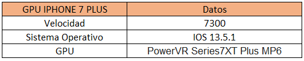

# Trabajo final integrador
## Integrantes
- Prados, Nehuen (Legajo: 123105)
- Sciarrotta, Nicolas (Legajo: 141707)

## Propuesta

### Idea general
La propuesta del trabajo final, consiste en construir un prototipo de blockchain [27] paralelizable.
El concepto básico de blockchain es bastante simple: una base de datos que mantiene una lista en continuo crecimiento de registros ordenados:


Algo muy similar a un log de transacciones de una base de datos.
Como se puede observar en la imagen, existe un orden y una secuencialidad en las operaciones que se registran en una blockchain, haciendo que, 
si bien el contenido de cada bloque se puede generar de forma distribuida, su procesamiento deba ser centralizado.


El objetivo de este proyecto, es presentar un prototipo de arquitectura que permita paralelizar la generación de bloques, gráficamente sería algo así:
La principal ventaja de esta arquitectura frente a las actuales, es que, si dos operaciones no son mutuamente excluyentes o secuenciales, pueden ser realizadas
en paralelo, a diferencia de las blockchain actuales que fuerzan a que sea secuencial.
Para lograr esto, se propone utilizar herramientas vistas en la materia como RabbitMQ para el manejo de colas de los bloques, CUDA para el cálculo criptográfico intensivo
de hashes y resolución de desafíos y una arquitectura cliente servidor para la comunicación con los usuarios.
Los goles principales serán:
1. Mecanismo de sincronización y bloqueos empleando RabbitMQ
2. Mecanismo de calculo de hashes empleando CUDA
3. Lógicas / Validaciones de negocio parametrizables
4. UI Web para el usuario final

### Arquitectura

A grandes rasgos, la arquitectura general pude verse como en la imagen de la izquierda, en la UI web el usuario contara con la posibilidad de solicitar aperturas
de cuenta y transferencias de fondos además de una pantalla de solo lectura donde podra ver los saldos consolidados de todas las cuentas y historial de los
bloques procesados.
En la capa del servidor, se encontrará la lógica del negocio, aquellas validaciones sobre las entradas de los usuarios, si esta todo bien, la solicitud se encolara
en el server rabbitmq. 
El server de rabbitmq contiene las colas de operaciones pendientes y una cola para cada cuenta, sirviendo esto como herramienta de sincronización distribuida. 
Los workers tendrán como función commitear los bloques, para esto hay dos funciones principales, la de armar los bloques y la de procesarlos, el creador lee de rabbitmq las operaciones pendientes y las encola en bloques, el procesador lee de la cola de bloques pendientes y las procesa utilizando CUDA para el cálculo de los challenge.


### Estructura de bloque 
El primer paso lógico es decidir la estructura del bloque. Para mantener las cosas lo más simples posible, incluimos solo las necesarias: índice, marca de tiempo, datos,
hash y hash previo. 
El hash del bloque anterior debe encontrarse en el bloque para preservar la integridad de la cadena Hash de bloque.
El bloque necesita ser hasheado para mantener la integridad de los datos. Un SHA256 se toma sobre el contenido del bloque (incluyendo marca de tiempo, datos, índice y hash previo).
Para generar un bloque, debemos conocer el hash del bloque anterior y crear el resto del contenido requerido (índice, hash, datos y marca de tiempo). 

### Los datos de bloque
son algo proporcionado por el usuario final sobre los cuales se aplican validaciones de negocio.
El hash de cada bloque a agregar será realizado mediante una prueba de trabajo (minería) donde se utilizará el cómputo paralelo para que los mineros compitan por los
siguientes bloques a incorporar.
Además de las tecnologías antes mencionadas, se implementará una base de datos Rethinkdb [10] para el almacenamiento de los bloques ya procesados y la historial, a
fines de ser usada como repositorio de solo lectura de los bloques procesados.
Con respecto a las métricas, se propone crear dos workers procesadores, uno en CUDA y otro en secuencial, de manera tal que se pueda comprar el rendimiento de
ambos a distintas escalas de challenges.
Además de propone crear una variable que sea máximas transacciones por bloque, de manera tal que si se la setea en 1, seria una blockchain tradicional y si se le aumenta
el numero se pueda medir la ventaja en rendimiento de esta estructura.

## Infraestructura

En la creacion de la infraestructura necesaria para montar el sistema, se optó 
por utilizar un esquema donde cada parte sea una unidad autónoma mínima, es 
decir, donde cada modulo que pueda funcionar de forma independiente sea montado
por separado.

Para toda la infra se utilizo Docker[5] con imagenes oficiales las cuales se
mencionaran a continuacion a medida que se las explique.

	Antes de continuar es valido mencionar que en todos los casos, se estan 
	creando imagenes nuevas con un tag especifico, a los fines de mantener una 
	abstraccion entre la logica de la arquitectura planteada y las herramientas 
	que se utilizan para implementarla.

### Frontend estatico

En el modulo de servidor estatico, se monto el siguiente esquema:

```
+---------------------+
|     BALANCEADOR     |
+----------+----------+
| SERVER 1 | SERVER 2 | 
+---------------------+
```

Para el balanceador se utilizo Nginx[1] con el modulo de Upstream[2] para el
balanceo de carga, en el caso de los servers, se utilizo el modulo Core[3] para
servir los archivos estaticos de una forma eficiente.
En lo que respecta al frontend, se utilizo la plantilla web libre Identity[4] a
fines de crear una UI web para operar el sistema.
La UI se basa en un conjunto basico de archivos estaticos los cuales consumen la
API REST del backend mediante request en segundo plano.
Los servers y el balanceador escuchan cada uno en el puerto 80, sin embargo en 
el caso del balanceador, dicho puerto fue mapeado al 12000 externo.

El primer paso para la creacion del modulo, es construir las imagenes de docker 
necesarias, para este fin, se creo el directorio docker-images con los archivos
y configuraciones utilizadas para la creacion de los containers.

```
# El tag front-static fue seleccionado para los server staticos.
cd /docker-images/frontend-static/
docker build --tag front-static .
```

En este caso, se utilizo como base la Imagen Oficial de Nginx[6] y se le 
reemplazo la configuracion por una mas conveniente para el uso que se le dara.

```
# El tag front-balancer fue seleccionado para los server staticos.
cd /docker-images/frontend-balancer/
docker build --tag front-balancer .
```

En este caso, se utilizo nuevamente la misma imagen oficial pero con una 
configuracion diferente para que actue como balanceador.

Se creo el archivo /docker-compose.yml con la estructura necesaria para levantar
el trio de containers y poner en marcha el balanceador.

### Api REST Backend

En el modulo de servidor backend, se monto el siguiente esquema:

```
+---------------------+
|     BALANCEADOR     |
+----------+----------+
| SERVER 1 | SERVER 2 | 
+---------------------+
```

Para el balanceador se utilizo Nginx con el modulo de Upstream para el
balanceo de carga, en el caso de los servers, se utilizo Openjdk[7].
En lo que respecta a la programacion de la API, se utilizo Spring[8] a
fines de crear la API REST para ofrecer el contenido al frontend.
Los servers y el balanceador escuchan cada uno en el puerto 80, sin embargo en 
el caso del balanceador, dicho puerto fue mapeado al 12001 externo.

En el directorio /api/back se ubico el codigo fuente de la API rest hecha en Java
con Spring para el backend.

### Api REST Mineros

En el directorio /api/miner se ubico el codigo fuente de la API rest hecha en Java
con Spring para los mineros.
La arquitectura de esta Api es analoga a la del backend.

### Base de datos

Para el almacenamiento de los bloques ya procesados se utilizara la base de 
datos Rethinkdb[9] la cual posee un mecanismo de replicacion en cluster[10] que
la hace tolerante a fallos, en este caso la arquitectura utilizada es:

```
+-----------------------+
|   PROXY BALANCEADOR   | 
+-----------------------+
| SERVER 1 <=> SERVER 2 | 
+-----------+-----------+
|  SHARD 1  |  SHARD 2  |
+-----+-----+-----+-----+
|  R1 | R2  |  R1 | R2  |
+-----+-----+-----+-----+
```

Para montar esta configuracion se modifico el entrypoint[11] de docker, ya que
es necesario enviar a la herramienta los comandos adecuados para su 
funcionmiento en cluster.
En /docker-images/storage-db se creo la imagen de la base de datos basada en la
imagen oficial de rethinkdb[12].

```
# El tag storage-db fue seleccionado para los server de datos.
cd /docker-images/storage-db/
docker build --tag storage-db .
```

Los servers se clusterizan automaticamente y ofrecen una interface unificada de
administracion, en el caso del primer nodo, se mapeo el puerto 8080 al 12002 de
manera de tener acceso a la interface grafica de administracion del cluster.

Para maximizar la redudancia y la tolerancia a fallos, se configuro el cluster
con dos shards (replicas en servidores diferentes del cluster) y 2 replicas por
shards (redundancia dentro del mismo server) de manera tal que hay 4 instancias
de datos disponibles. Esto se realizo desde la UI de la db.
Ademas se incluyo un nodo proxy que es el responsable de realizar el balanceo y
garantizar la alta disponibilidad.
En el caso del proxy, se expone el puerto 28015 que es el utiliza por defecto la
base de datos para las conexiones de los clientes mediante el driver.

```
# El tag storage-balancer fue seleccionado para el proxy de los datos.
cd /docker-images/storage-balancer/
docker build --tag storage-balancer .
```

### Colas MQ

Para el manejo de las colas, se utilizo la herramienta RabbitMQ[13] la cual 
provee un macanismo de cluster[14] que la hace tolerante a fallos, en este caso 
la arquitectura utilizada es:

```
+-----------------------+
|   PROXY BALANCEADOR   | 
+-----------------------+
| SERVER 1 <=> SERVER 2 | 
+-----------+-----------+
```

En /docker-images/mq-rabbit se creo la imagen de rabbitmq basada en la imagen 
oficial[15].

```
# El tag mq-rabbit fue seleccionado para los server de rabbit.
cd /docker-images/mq-rabbit/
docker build --tag mq-rabbit .
```

Dado que RabbitMQ no viene con un balanceador, se implemento HA Proxy[16] el 
cual a diferencia de Nginx que solo provee soporte HTTP, HA provee un mecanismo
de balanceo de carga a nivel TCP, el cual lo hace idoneo para gestionar las 
comunicaciones con la herramienta RabbitMQ.

En /docker-images/mq-balancer se creo la imagen de HA basada en la imagen 
oficial[17].

```
# El tag mq-balancer fue seleccionado para los server de rabbit.
cd /docker-images/mq-balancer/
docker build --tag mq-balancer .
```

### Software API

Para la construccion de la API, se utilizo el protocolo JSON, empleando la 
herramienta GSON[18].

### Software Mineros 

#### WebCrypto [CPU]
En el caso de los mineros, se realizaron dos implementaciones, una basada en 
browser, utilizando las API de WebCrypto[19] las cuales son compatibles con la 
mayoria de dispositivos modernos, dado que acorde a los estandares solo estan 
disponibles en contextos seguros[20], se implemento un certificado SSL de 
Letsencrypt [21] para poder utilizar esta funcionalidad.

#### CUDA [GPU]
Ademas se implemento una variante del minero en CUDA[22], para lo cual primero se
debio de instalar el toolkit necesario, como en el equipo que se probo utiliza
Manjaro[23], una distro basada en Arch[24] se debio realizar una configuracion
especial para lograr que funcione correctamente, dado que Arch tiene todos los 
paquetes actualizados a la última versión y van más rápido las actualizaciones 
de arch que los releases de nvidia, no funcionaba el compilador con el driver, 
eso lo verificamos porque nvcc -V y nvidia-smi mostraban versiones diferentes 
(10.2 y 10.1 respectivamente) entonces la solucion fue desinstalar todos los
paquetes de cuda instalados desde los repo de arch mediante pacman y seguir 
los pasos[25] recompilando cuda 10.1 desde los fuentes, ademas de eliminar todos
los kernels instalados salvo 4.19, es necesario esta versión porque los driver 
de CUDA no funcionan con kernels más nuevos.

En el caso del minero CUDA, se implemento una libreria de hash sha256 disponible 
para CUDA[26] y un algoritmo de fuerza bruta.

## Benchmarks

Se realizaron benchmarks de las diferentes pruebas realizadas, a continuacion
las graficas obtenidas:

### Grafico de rendimiento para desafios 1 a 4


### Grafico de rendimiento para desafios 5 a 10


### Grafico de rendimiento para desafios 1 a 10


### Especificaciones

#### CPU Movil


#### CPU Desktop


#### GPU Movil




#### GPU Desktop


## Conclusiones

En base a la experiencia realizada, podemos concluir que separando cada parte de la logica del proyecto en diferentes unidades de procesamiento independientes, se logra una tolerancia
a fallos muy superior a un esquema centralizado, ya que, cada componente logico puede fallar sin afectar al funcionamiento del resto.
En este caso, se ve que puede estar completamente caida una unidad funcional como por ejemplo los servidores de API de minero, y todo el resto del sistema funcionar correctamente.
Para que el sistema se quede completamente fuera de funcionamiento se requiere que al menos 3 unidades funcionales colapsen en simultaneo, lo cual es un 300% mejor, que si todo el sistema depende de una sola unidad.
El hecho de desacoplar las tareas usando un servidor MQ (en este caso RabbitMQ) es una forma diferente de pensar la arquitectura de un sistema, ya que fuerza al desacople desde la etapa inicial, y si bien esto requiere un mayor esfuerzo al inicio, los beneficios se pueden apreciar en el corto plazo al obtener resilencia ante fallos y facilitar la escalabilidad.
La herramienta de virtualizacion que se utilizo (Docker) resulto ser realmente interesante y muy util para el desarrollo del proyecto, la misma se presenta como una alternativa a las maquinas virtuales tradicionales siendo sus prestaciones y ventajas notablemente superiores a sus predecesores, al permitir gestionar multiples imagenes de forma simple. Cabe destacar en este punto, que el uso que se le dio a determinadas funciones de esta herramienta, solo fueron posibles gracias al taller recibido dentro de la materia, el cual aporto valiosos conocimientos que fueron de utilidad para profundizar en esta herramienta.
En lo que respecta al procesamiento paralelo, se puede concluir claramente que su rendimiento es muy superior al monoprocesamiento, sin embargo, su uso en tareas chicas no es optimo, ya que el tiempo necesario para inicializar la GPU se desperdicia, podemos hacer una analogia entre la GPU con un vehiculo con mucha velocidad punta pero poca aceleracion y a la CPU con un vehiculo con mucha aceleracion y poca velocidad punta, como futuros profesionales debemos elegir el vehiculo adecuado para correr en cada pista, en el caso de este proyecto, las tareas de minado son ideales para delegar en la GPU mientras que las tareas que involucran logica de negocios se realizan mejor en CPU.
En resumen, las herramientas y conceptos aprendidos a lo largo de la cursada que fueron aplicados en este trabajo son de suma utilidad para la practica profesional y nos han servido para mejorar el enfoque a la hora de desarrollar arquitecturas ante los futuros proyectos y desafios creando soluciones mas robustas y performantes.


## Referencias:

[1] 	https://nginx.org/
[2] 	https://nginx.org/en/docs/http/ngx_http_upstream_module.html
[3] 	https://nginx.org/en/docs/http/ngx_http_core_module.html
[4] 	https://html5up.net/identity
[5] 	https://www.docker.com/
[6] 	https://hub.docker.com/_/nginx
[7] 	https://hub.docker.com/_/openjdk
[8] 	https://spring.io/
[9] 	https://rethinkdb.com/
[10] 	https://rethinkdb.com/docs/sharding-and-replication/
[11] 	https://docs.docker.com/engine/reference/builder/#entrypoint
[12] 	https://hub.docker.com/_/rethinkdb
[13] 	https://www.rabbitmq.com/
[14] 	https://www.rabbitmq.com/clustering.html
[15] 	https://hub.docker.com/_/rabbitmq
[16]  	https://www.haproxy.org/
[17]  	https://hub.docker.com/_/haproxy
[18]	https://github.com/google/gson
[19]	https://developer.mozilla.org/es/docs/Web/API/Web_Crypto_API
[20]	https://developer.mozilla.org/en-US/docs/Web/Security/Secure_Contexts/features_restricted_to_secure_contexts
[21]	https://letsencrypt.org/es/
[22]	https://developer.nvidia.com/cuda-toolkit
[23]	https://manjaro.org/
[24]	https://www.archlinux.org/
[25]	https://douglasrizzo.com.br/cuda-manjaro/
[26]	https://github.com/moffa13/SHA256CUDA
[27] 	https://en.wikipedia.org/wiki/Blockchain_%28database%29